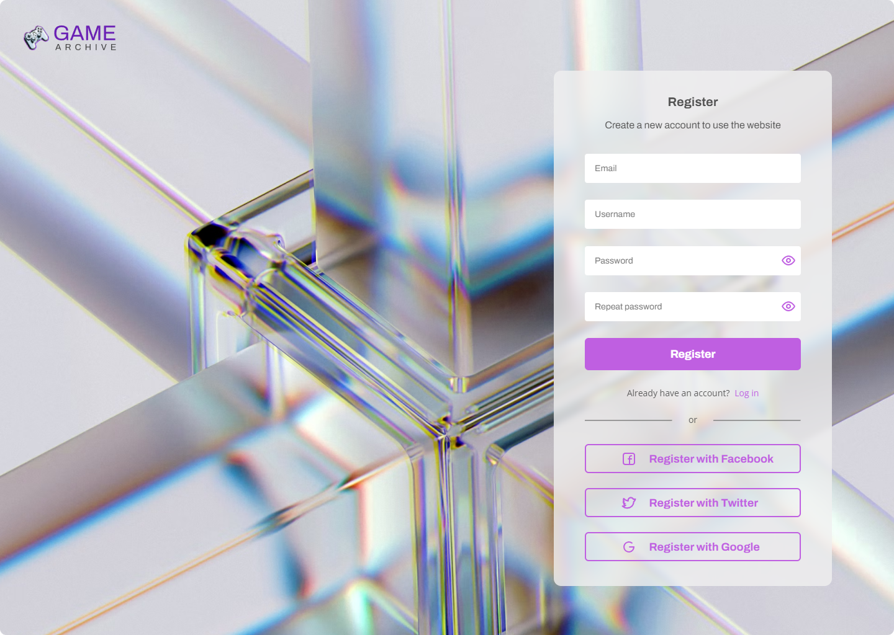
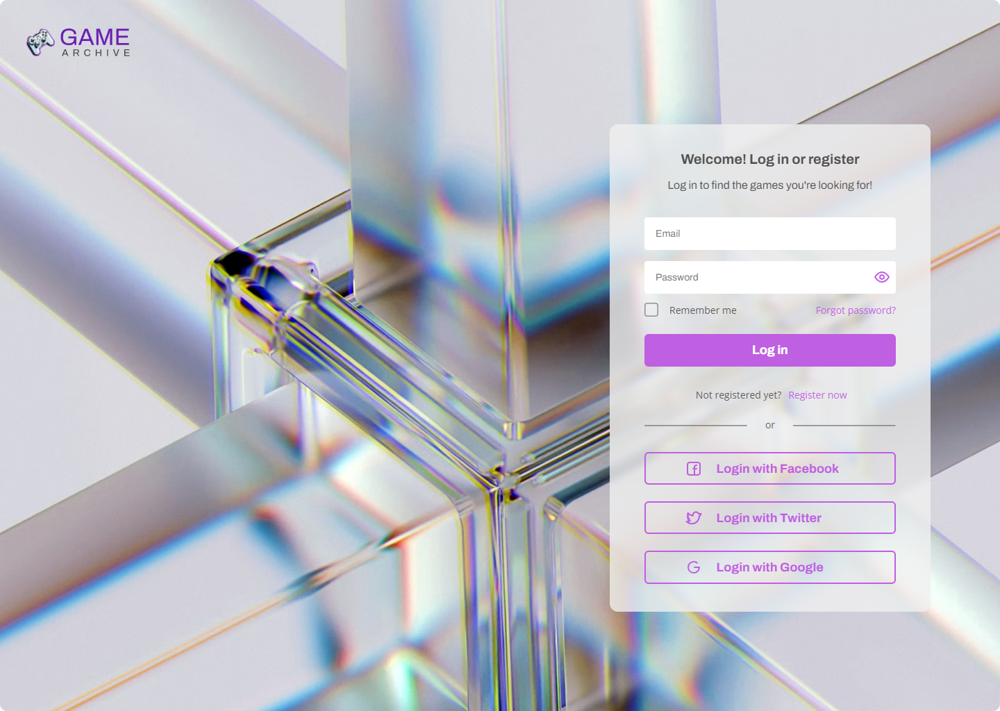
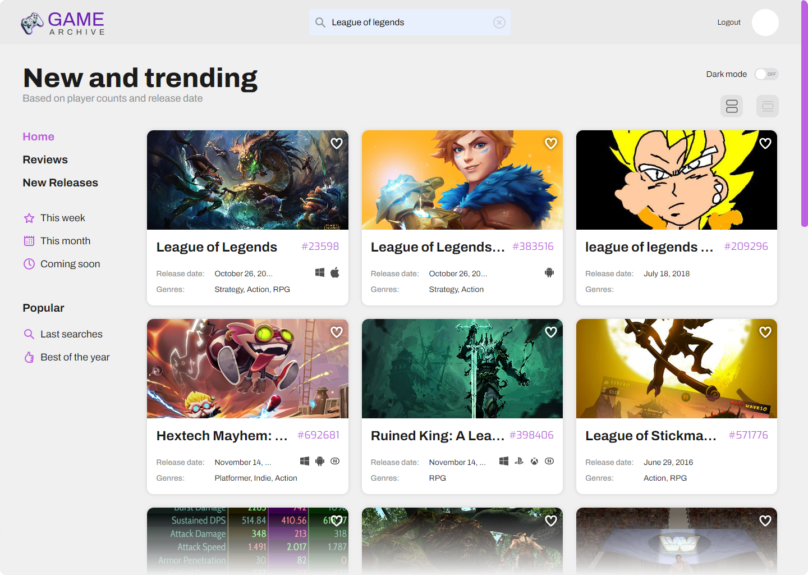
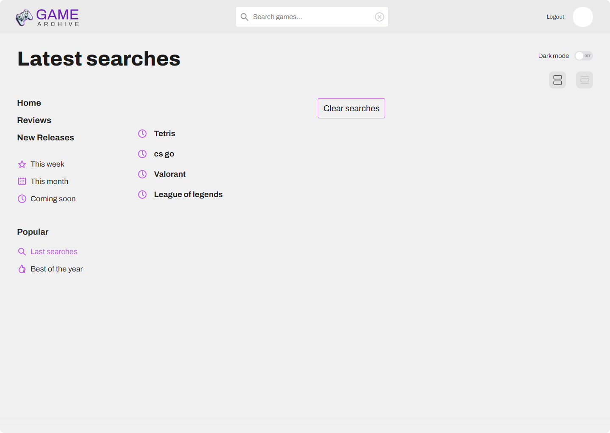
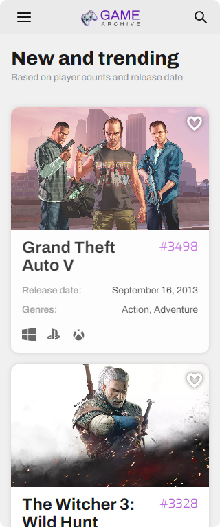
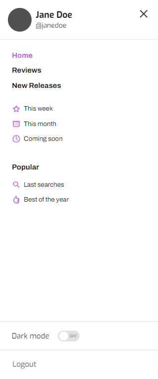
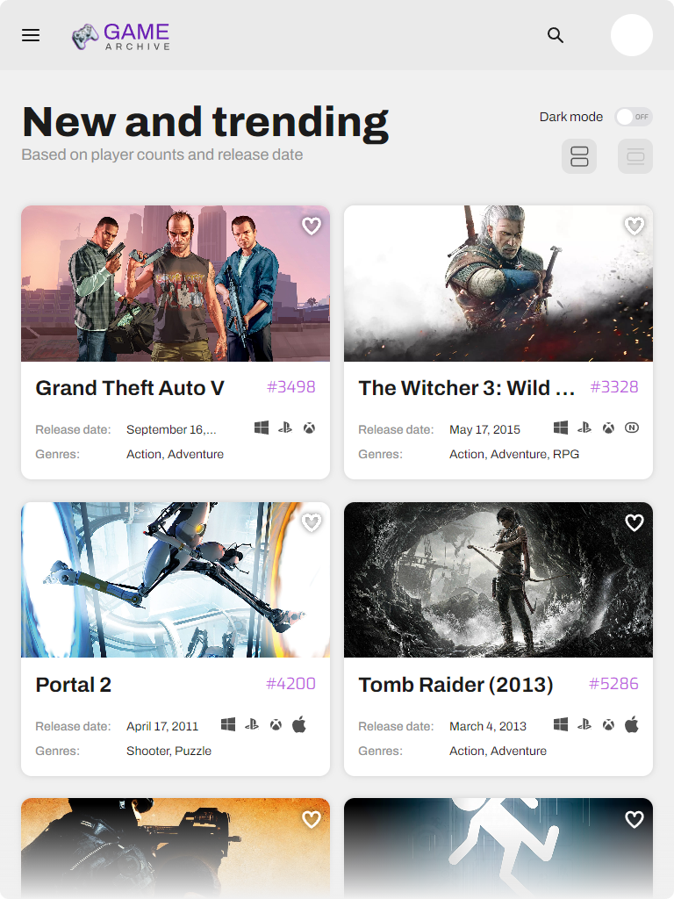
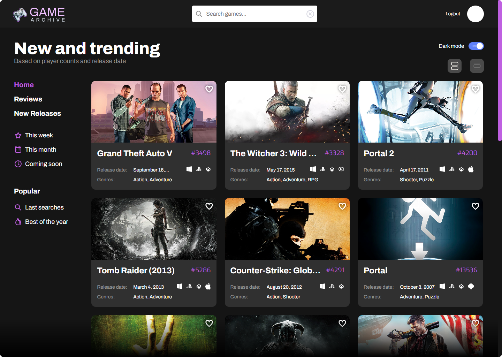
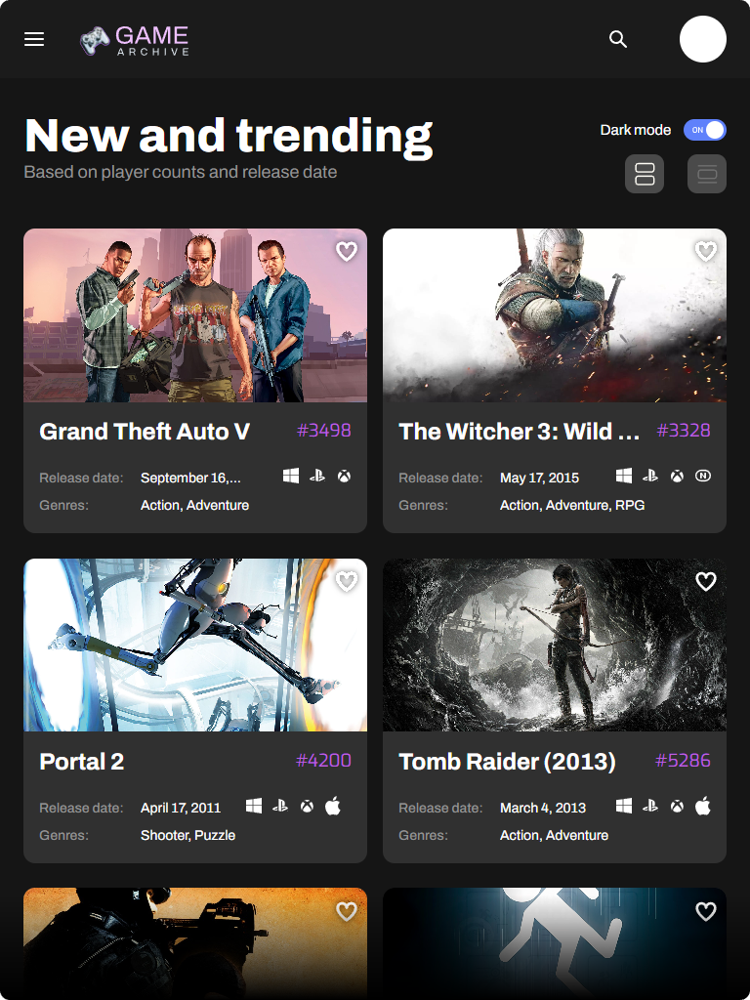

<div align="center">
<h1 align="center">

<br>AltimetrikGameFinderApp
</h1>
<h3>◦ Developed with the software and tools listed below.</h3>

<p align="center">


</p>
</div>

---

## 📒 Table of Contents

-   [📒 Table of Contents](#-table-of-contents)
-   [&nbsp;📍&nbsp; Overview](#-overview)
-   [🔧 Features](#-features)
-   [🧩 Modules](#modules)
-   [🚀 Getting Started](#-getting-started)
-   [🗺 Roadmap](#-roadmap)
-   [👏 Acknowledgments](#-acknowledgments)

---

## 📍 Overview

Game Finder is a web application designed to provide users with an easy way to search for and view data about various games using the <a href="https://rawg.io/apidocs">RAWG API</a>. Whether you want to explore new games or find information about your favorite titles, Game Finder has got you covered.

---

## 🔧 Features

### <h1>1. 📝 Register</h1>

-   Register a new account to access the page (a default account was already created, so you don't have to; more information will be provided in the login section).
-   Use **JSON Server Auth** to register your account into the database (please note that this is a mock database for front-end purposes, and its functionalities are limited and insecure).
-   See the account creation process in the [Account creation Demo](https://scribehow.com/shared/Create_your_GameFinder_account__boIPYb8xTb2z2FDXV3Ykxg).



<br>

### <h1>2. 🔑 Login</h1>

-   Use **JSON Server Auth** to log into your new account.
-   Use of _session token_ for authenticated created accounts.
    -   Default account created has the email: **exampleemail@gmail.com** and the password **password123**.
    -   You are also welcome to log in with your own registered account.



<br>

### <h1>3. 🔎 Games Searching</h1>

-   Search for any games you want on the page.
-   Get a fast response with a list of games with the name that you search using the **RAWG API**.



<br>

### <h1>4. ⏱️ Last Searches</h1>

-   Use of **Local Storage** to store latest searches made.
-   Get a list of latest searches and click on any of them to return to the search.



<br>

### <h1>5. 📱 Mobile/Tablet Friendly Design</h1>

-   You can use **Game Finder** from any of your devices!
-   Example images about responsive design:

<div align="center">
  
  
  
</div>

<br>

### <h1>6. 🌓 Dark/Light Mode Support</h1>

-   Use **GameFinder** in the theme that you prefer!
-   We set the theme to your computer's preferred schema, but you can change it anytime you want from inside the app.

<div align="center">
  
  
</div>

---

<br>

## 🧩Modules

<details closed><summary>Root</summary>

| File                                                                                                                                   | Summary                                        |
| -------------------------------------------------------------------------------------------------------------------------------------- | ---------------------------------------------- |
| [index.html](https://github.com/elios11/AltimetrikGameFinder-React/blob/main/index.html)                                               | Root of page HTML                              |
| [login.html](https://github.com/elios11/AltimetrikGameFinder-React/blob/main/src/components/LoginForm/LoginForm.jsx)                   | Login Component                                |
| [register.html](https://github.com/elios11/AltimetrikGameFinder-React/blob/main/src/components/RegisterForm/RegisterForm.jsx)          | Register Component                             |
| [main.jsx](https://github.com/elios11/AltimetrikGameFinder-React/blob/main/src/main.jsx)                                               | Root component of the page                     |
| [index.css](https://github.com/elios11/AltimetrikGameFinder-React/blob/main/src/index.css)                                             | Global Styles                                  |
| [formatDate.js](https://github.com/elios11/AltimetrikGameFinder-React/blob/main/src/utils/formatDate.js)                               | Date Formatting                                |
| [Layout.jsx](https://github.com/elios11/AltimetrikGameFinder-React/blob/main/src/components/Layout/Layout.jsx)                         | Home Page Layout component                     |
| [authFormValidations.js](https://github.com/elios11/AltimetrikGameFinder-React/blob/main/src/utils/authFormValidations.js)             | Login and Register pages validation            |
| [GamesContainer.jsx](https://github.com/elios11/AltimetrikGameFinder-React/blob/main/src/components/GamesContainer/GamesContainer.jsx) | Games display component                        |
| [GamesHub](https://github.com/elios11/AltimetrikGameFinder-React/blob/main/src/components/GamesHub)                                    | Game pages components                          |
| [redirectUnloggedUser.js](https://github.com/elios11/AltimetrikGameFinder-React/blob/main/src/hooks/UseIsLoggedIn.jsx)                 | Check if user is logged in                     |
| [loginHandlers.js](https://github.com/elios11/AltimetrikGameFinder-React/blob/main/src/utils/loginHandlers.js)                         | Handle register or login                       |
| [showCardData.js](https://github.com/elios11/AltimetrikGameFinder-React/blob/main/src/components/GameDataModal/GameDataModal.jsx)      | Game Card Data Display                         |
| [ThemeContext.jsx](https://github.com/elios11/AltimetrikGameFinder-React/blob/main/src/context/ThemeContext.jsx)                       | Dark/Light Mode toggle context                 |
| [colors.css](https://github.com/elios11/AltimetrikGameFinder-React/blob/main/src/utils/helper-styles/colors.css)                       | Design color variables and dark mode variables |
| [Header.jsx](https://github.com/elios11/AltimetrikGameFinder-React/blob/main/src/components/Header/Header.jsx)                         | Header navigation bar component                |
| [LastSearches.jsx](https://github.com/elios11/AltimetrikGameFinder-React/blob/main/src/components/LastSearches/LastSearches.jsx)       | Last Searches component                        |
| [Dialog.jsx](https://github.com/elios11/AltimetrikGameFinder-React/blob/main/src/components/Dialog/Dialog.jsx)                         | Dialog/Modal component                         |
| [Sidebar.jsx](https://github.com/elios11/AltimetrikGameFinder-React/blob/main/src/components/Sidebar/Sidebar.jsx)                      | Sidebar component                              |

</details>

---

## 🚀 Getting Started

### ✔️ Prerequisites

Before you begin, ensure that you have the following prerequisites installed:

-   ℹ️ Make sure you have Node.js installed on your machine. You can download it from the official website: <a href="https://nodejs.org/"><em>Node.js</em></a>.
-   ℹ️ NPM (Node Package Manager) comes bundled with Node.js, so you should have it installed as well.

### 📦 Installation

1. In a terminal, clone the AltimetrikGameFinderApp repository:

```sh
git clone https://github.com/elios11/AltimetrikGameFinder-React
```

2. Open the project folder:

```sh
cd AltimetrikGameFinder-React
```

3. Install dependencies:

```sh
npm install
```

### 🎮 Using AltimetrikGameFinderApp

```sh
Run the command: npm start

And you should be in! The app will run on http://localhost:5173/ by default.
```

## 🗺 Roadmap

-   [x] ℹ️ Task 1: Create project on GitHub
-   [x] ℹ️ Task 2: Create Login Screen View
-   [x] ℹ️ Task 3: Add Login functionality
-   [x] ℹ️ Task 4: Connect with RAWG API
-   [x] ℹ️ Task 5: Create the card list with one column
-   [x] ℹ️ Task 6: Create the card list with three columns
-   [x] ℹ️ Task 7: Add skeleton for loading cards
-   [x] ℹ️ Task 8: Create the side bar
-   [x] ℹ️ Task 9: Create the header with search bar
-   [x] ℹ️ Task 10: Implement search game functionality
-   [x] ℹ️ Task 11: Add last searches functionality
-   [x] ℹ️ Task 12: Add Game Modal functionality
-   [x] ℹ️ Task 13: Implement theme toggle functionality
-   [x] ℹ️ Task 14: Add last week games page
-   [x] ℹ️ Task 15: Add last month games page
-   [x] ℹ️ Task 16: Add last year games page
-   [x] ℹ️ Task 17: Add coming soon games page
-   [x] ℹ️ Task 17: Implement 'Remember Me' login functionality
-   [x] ℹ️ Task 18: Implement a 'Register' page

---

## 👏 Acknowledgments

-   ℹ️ The design and idea of this project was made by [Altimetrik](https://altimetrik.com/) for their Become a Front End Developer with Altimetrik program.
